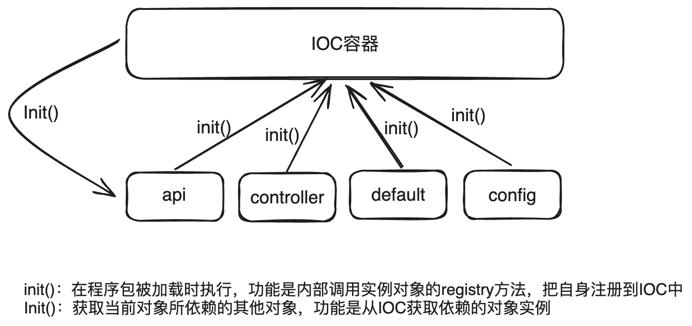

# ioc
Ioc，即"inversion of control"的缩写，较为容易的理解就是"对象依赖关系反转"。这里有三个要点，对象，依赖，反转。如果程序中有A对象，而在实例化对象A的时候需要用到实例B，则称B为A的依赖，也就是A依赖B。当我们需要实例化A的时候，就必须先有一个实例B的对象，然后才能实例化A。  

当使用ioc后，对象间的关系被改变：实例A和实力B在程序启动时都会向一个注册中心注册自己，当需要实例化A的时候，只需要从注册中心获取到B的实例。本程序中使用嵌套形式的map数据类型来实现ioc容器,工作原理演示如下：

